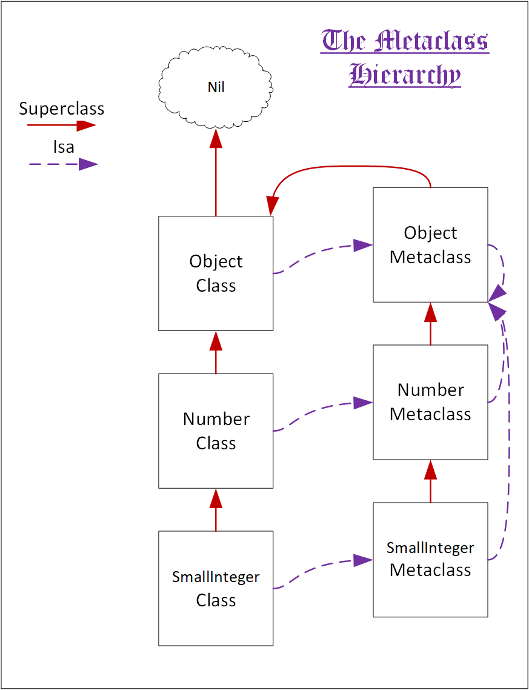

# The Oopsilon Object Model

### Overview
An Object in Oopsilon has a very simple definition. It is something which can
respond to messages. Every entity in an Oopsilon system is an object.

### An object

An object responds to messages. How does it do this? It runs a method. All
simple so far. How do we define what messages an object can respond to? The
answer is in its class. There is a single special variable in Oopsilon which
all objects have: the `isa` pointer. It is a *classOop* - an *oop* pointing
to a class object. An *oop* is simply a tagged pointer to an object.

### A class

A class is an object of a special sort: it describes how objects instantiating it
are created, and what messages they respond to, as well as the name of the
class. Every object has a class. And that includes classes, too. A class is an
instance of an object's metaclass, which is just a class that describes how
a particular class object is created, and - exactly like how class objects
describe the variables held by each instance and the messages which their
instances understand - a metaclass describes what variables the class object
they describe holds and what messages the class understands.

A metaclass is always an instance of the Object metaclass, including the Object
metaclass, which is an instance of itself.

Classes also have superclass *oop*s. The superclass *oop* points to the a
*classOop* representing the class' superclass. The root of the inheritance
tree is the Object class. Even the Object metaclass' superclass is the Object
class. And the Object class has a superclass of nil.

In deciding what instance variables an object X of class Y has, this is the
procedure followed: the superclass chain of Y is searched up to the terminal
superclass. The terminal superclass, let's say for purpose of discussion,
defines the instance variables A, B, and C. So our object has, so far, these
instance variables:

- At index 1, A.
- At index 2, B.
- At index 3, C.

Suppose the next step down the superclass chain from the terminal superclass
defines the instance variable D. Then at index 4, the object has instance
variable D. This is the simple algorithm that assigns indexes to instance
variables.

For messaging, an object's class first searches for a method in its dictionary
which matches the message being sought. If it finds one, it returns it. If it
doesn't, and there is a superclass of the class, it searches the superclass.
If search reaches the terminal superclass and no method is found, then search
begins anew, only this time, it is for the message doesNotUnderstand:, a method
which handles message-not-found errors.